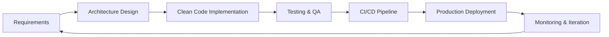

# <div align="center">🚀 Diego Botina | Software Engineer & System Architect</div>

<div align="center">


[](https://github.com/CodeWithBotinaOficial)
[](https://www.youtube.com/@CodeWithBotina)
[](https://linkedin.com)

</div>

---

##  **About Me**

Computer Science student and passionate software engineer with a focus on **building scalable systems** and **clean, maintainable code**. Currently developing **InventaOne**, a SaaS inventory management platform for small and medium businesses.

```javascript
const botina = {
    location: "Buga, Colombia 🇨🇴",
    education: "Commercial Software Engineering with a concentration in {Design and Architecture} @ Jala University",
    currently: "Building InventaOne - Inventory Management SaaS",
    interests: ["System Architecture", "Clean Code", "DevOps", "Tech Education"],
    learning: ["Cloud Architecture", "Microservices", "DevOps Practices"],
    funFact: "I believe software should inspire confidence in users and pride in developers"
};
```

---

##  **Tech Stack & Expertise**

<div align="center">

### 💻 **Languages**


### 🛠️ **Frameworks & Tools**


### 🏗️ **Development Practices**


### 📐 **Architecture & Patterns**


</div>

---

##  **Current Focus: InventaOne**

<div align="center">

### 🎯 **Building the Future of Inventory Management**

[](https://github.com/inventaone)

</div>

**InventaOne** is a comprehensive SaaS platform designed to revolutionize inventory management for small and medium-sized businesses. This project represents my transition from academic projects to production-ready enterprise software.

**🔧 Technical Highlights:**
- **Architecture:** Microservices-based architecture with clear separation of concerns
- **Stack:** Modern web technologies with scalable backend infrastructure
- **Features:** Real-time inventory tracking, multi-user management, analytics dashboard, reporting
- **Focus:** Performance optimization, security best practices, and user experience

**📊 Project Status:** *Active Development - Beta Phase*

---

##  **Featured Projects**

### 🔬 **Personal Projects**

<table>
<tr>
<td width="50%">

#### 🧮 [CalcPlusPlus](https://github.com/CodeWithBotinaOficial/CalcPlusPlus)
**Modern Scientific Calculator**
- Built with C++17 & Qt6
- SQLite-based history tracking
- Professional GUI with dark theme
- Automated releases via GitHub Actions

**Tech:** `C++` `Qt6` `SQLite` `CMake`

</td>
<td width="50%">

#### ✅ [TaskForge](https://github.com/CodeWithBotinaOficial/TaskForge)
**Team Task Management System**
- Desktop application with JavaFX
- Team collaboration features
- Role-based access control
- Real-time notifications

**Tech:** `Java` `JavaFX` `SQLite` `Maven`

</td>
</tr>
<tr>
<td width="50%">

#### 🎵 [Audio Enhancer](https://github.com/CodeWithBotinaOficial/audio_enhancer)
**Audio Processing Tool**
- Real-time audio enhancement
- Multiple filter algorithms
- Professional audio processing

**Tech:** `Python` `Audio Processing`

</td>
<td width="50%">

#### 🎨 [ChromaLab](https://github.com/CodeWithBotinaOficial/ChromaLab)
**Color Theory & Design Tool**
- Interactive color experimentation
- Design system utilities
- Visual learning platform

**Tech:** `JavaScript` `Web APIs`

</td>
</tr>
</table>

### 🎓 **Academic Capstone Projects @ Jala University**

<table>
<tr>
<td width="50%">

#### 🛰️ [TopoVision](https://github.com/JalaU-Capstones/topovision)
**3D Topographic Analysis System**
- Real-time terrain visualization
- Computer vision with OpenCV
- Calculus-based gradient computation
- Published on PyPI

**Tech:** `Python` `OpenCV` `NumPy` `Matplotlib`
**Role:** Technical Lead & System Architect

</td>
<td width="50%">

#### 💳 [Credit Card Module](https://github.com/JalaU-Capstones/credit-card-module)
**Financial Benefits Tracker**
- Credit card benefit tracking
- Smart recommendation engine
- Data-driven insights

**Tech:** `Java` `SQLite` `JavaFX`

</td>
</tr>
<tr>
<td width="50%">

#### 📝 [NotoFlow](https://github.com/JalaU-Capstones/NotoFlow)
**Intelligent Note-Taking System**
- Advanced note organization
- Tag-based categorization
- Search and filter capabilities

**Tech:** `Java` `JavaFX` `SQLite`

</td>
<td width="50%">

#### 🎓 [UniTutor](https://github.com/JalaU-Capstones/unitutor)
**Academic Tutoring Platform**
- Student-tutor matching system
- Session scheduling
- Progress tracking

**Tech:** `Java` `Database Design`

</td>
</tr>
<tr>
<td width="50%">

#### 🎮 [Gravity Shift](https://github.com/JalaU-Capstones/gravity-shift)
**Physics-Based Puzzle Game**
- Custom physics engine
- Progressive difficulty levels
- Engaging gameplay mechanics

**Tech:** `Java` `Game Development`

</td>
<td width="50%">

#### 🐍 [Snake Lineal](https://github.com/JalaU-Capstones/snake-lineal)
**Classic Game Reimagined**
- Modern twist on classic Snake
- Clean architecture
- Smooth animations

**Tech:** `Java` `JavaFX`

</td>
</tr>
</table>

**View More:** [March of the Legion](https://github.com/JalaU-Capstones/march-of-the-Legion) | [Game of Life](https://github.com/JalaU-Capstones/GameOfLife)

---

##  **Organizations & Collaborative Work**

<table align="center">
<tr>
<td align="center" width="33%">

### 🔬 **[JalaU-Labs](https://github.com/JalaU-Labs)**


**Academic Coursework Repository**
- Data Structures & Algorithms
- Database Design & Architecture
- Object-Oriented Programming
- Software Engineering Principles

*Hands-on labs from Programming II, Database II, and other core CS courses*

</td>
<td align="center" width="33%">

### 🎓 **[JalaU-Capstones](https://github.com/JalaU-Capstones)**


**Capstone Project Portfolio**
- Full-stack applications
- Team collaboration
- Real-world problem solving
- Applied knowledge showcase

*8+ complete capstone projects demonstrating practical skills*

</td>
<td align="center" width="33%">

### 🧪 **[CodeAlchemy-Labs](https://github.com/CodeAlchemy-Labs)**


**Technology Playground**
- Legacy tech exploration (COBOL)
- Emerging tech testing
- Polyglot programming
- Rapid prototyping

*Experiments with diverse technologies from classic to cutting-edge*

</td>
</tr>
</table>

---

##  **Development Workflow**



**My Approach:**
- 📐 **Architecture First:** Design scalable, maintainable systems from the start
- ✨ **Clean Code:** Following SOLID principles and design patterns
- 🧪 **Test-Driven:** Comprehensive testing for reliability
- 🔄 **Continuous Integration:** Automated workflows and deployments
- 📚 **Documentation:** Clear, comprehensive project documentation
- 🤝 **Collaboration:** GitHub Flow for team projects

---

##  **Content Creation**

<div align="center">

### 📺 **[@CodeWithBotina on YouTube](https://www.youtube.com/@CodeWithBotina)**


**🎬 Featured Series:**
- 🖥️ **Operating Systems Explained** - Understanding the brain of technology
- ⚙️ **Compiler vs Interpreter** - How code becomes execution
- 📜 **History of Programming Languages** - Secret origins and evolution
- 🚀 **Developer's Journey** - Introduction to the world of development

*Making complex computer science concepts accessible to everyone*

</div>

---

##  **GitHub Activity**

<div align="center">


### 🔥 **Contribution Streak**


<table>
<tr>
<td>


</td>
<td>


</td>
</tr>
</table>

</div>

---

##  **Let's Connect!**

<div align="center">

[](https://www.youtube.com/@CodeWithBotina)
[](https://www.tiktok.com/@codewithbotina)
[](https://github.com/CodeWithBotinaOficial)
[](mailto:codewithbotina.team@outlook.com)

### 💼 **Open to Collaboration**
I'm always interested in innovative projects, open-source contributions, and opportunities to learn and grow as a software engineer.

</div>

---

##  **Core Philosophy**

<div align="center">

> ### *"Software should not only run — it should inspire confidence in the user and pride in the developer."*
> 
> **Building systems that stand the test of time through:**
> - 🎯 **Clear Architecture** - Organized, scalable designs
> - ✨ **Clean Code** - Readable, maintainable implementations  
> - 🧪 **Rigorous Testing** - Reliable, bug-free experiences
> - 📚 **Comprehensive Documentation** - Knowledge sharing for the future
> - 🚀 **Continuous Improvement** - Always learning, always evolving

</div>

---

## 📊 **Quick Stats**

<div align="center">


</div>

---

<div align="center">

### 🌟 **Thank you for visiting!**

*Let's build something amazing together.*


</div>
